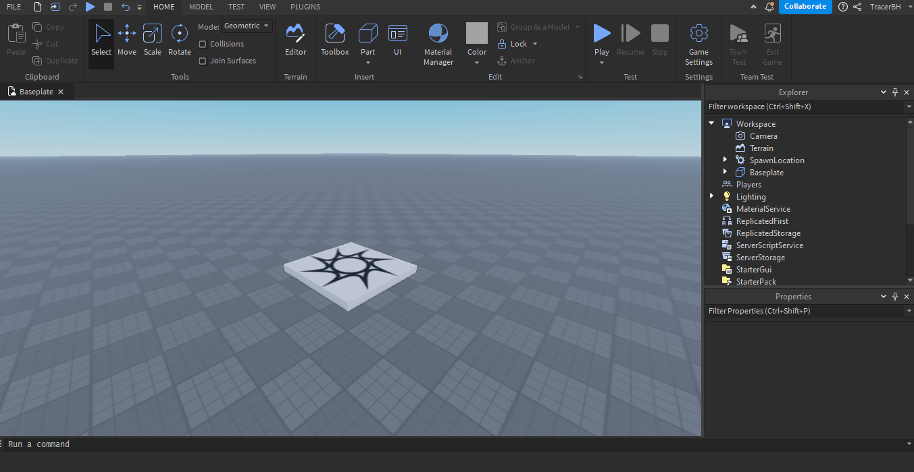

# Lesson 8 - Roblox tutorials

## Table of contents
- [Introduction](#introduction)
- [Begin](#begin)

<br/><hr/><br/><a name='introduction'></a>

## Introduction

Today we will learn how can you modify existing parts to make them awesome!

<br/><hr/><br/><a name='begin'></a>

## Begin

First we need to create a new place.
~~I think you know how to navigate in Studio.~~

* Open up your Roblox Studio
* Click "New" button on the left

* Choose "Baseplate"
After loading for a while you should see 

<i>I have the Beta version of studio.
The icons may change depending on a version
and type of the studio</i>

Now create a new script in "Workspace" service<br/>
<i>Yes. Workspace <b>is</b> a service</i>


<br/>

Now clear the script (remove `print("Hello, World!")`)

<br/><br/>

Create a new part inside of our workspace


And refer to that part in our script:
```lua
local part = game.Workspace.Part
```

We want to change its color. Hmmm... maybe... red?
<br/>
Red's RGB value is (255,0,0)<br/>
To change the property of an instance (everything in roblox is an Instance) use `instance.property` format.
In our case we want to change the "Color" property:

```lua
local part = game.Workspace.Part
part.Color = Color3.fromRGB(255,0,0)
```
We need to call the `fromRGB` function to convert RGB values to Color3 object

Now if we start our game we can see that our part changed color! Wonderful!


We can do that with nearly every property of an Instance.

Let's change size and position too.
```lua
part.Size = Vector3.new(5,2,5)
part.Position = Vector3.new(5,7,5)
```


But, why is our part not in air?
Because the gravity worked on our part.
We need to <b>Anchor</b> our part.
```lua
part.Anchored = true
```


<br/>

## Homework

* Randomize part's color
* Randomize part's transparency
* Change size after 5 seconds

<br/>

### Full code

```lua
local part = game.Workspace.Part
part.Color = Color3.fromRGB(255,0,0)
part.Size = Vector3.new(5,2,5)
part.Position = Vector3.new(5,7,5)
part.Anchored = true
```

<hr/><br/>

- ## [Part 7](7%20-%20Roblox%20basics.md)
<!--
- ## [Part 9](9%20-%20Roblox%20Turoail%20-%20pt.1.md)
-->